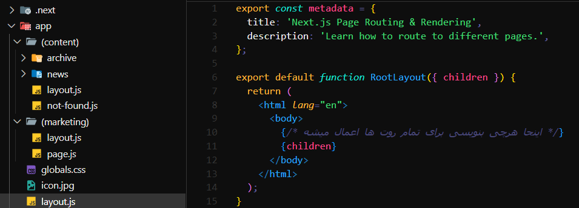
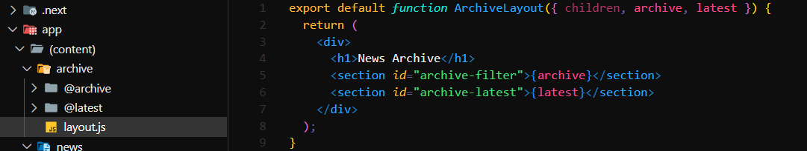

پوشه `(marketing)` در `app` یک `Route Group` است. پوشه‌های داخل پرانتز ( ) در `URL` ظاهر نمی‌شوند، اما به شما امکان می‌دهند مسیرهای مرتبط را سازماندهی کنید و برای آنها لی‌اوت مشترک (مانند `layout.js` داخل این پوشه) تعریف کنید. در این مثال، صفحات مرتبط با بازاریابی `(marketing/page.js و ...)` داخل این گروه قرار گرفته‌اند و لی‌اوت مشترک خود را دارند، اما مسیر آنها همچنان `/` یا `/about` خواهد بود `(بدون (marketing) در URL)`.

---

این ساختار از `Parallel Routing` استفاده می‌کند. پوشه `archive` دارای دو اسلات `(Slot)` به نام‌های `@archive` و `@latest` است. هر اسلات به صورت مستقل رندر می‌شود و در `layout.js` به ترتیب با نام‌های `archive` و `latest` دریافت می‌شوند. این قابلیت باعث می‌شود بخش‌های مختلف یک صفحه (مثلاً فیلتر آرشیو و جدیدترین اخبار) به صورت همزمان و بدون وابستگی به هم بارگذاری شوند.

